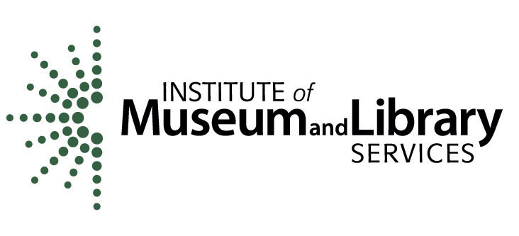
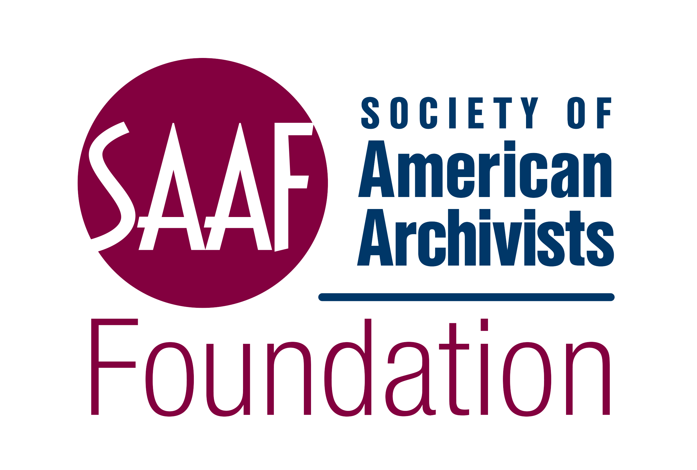

# ABOUT

## Archival Accessioning Best Practices

**ABP v.1.0**

_A set of best practices by the_

**NATIONAL BEST PRACTICES **_**for**_ \
**ARCHIVAL ACCESSIONING WORKING GROUP**

July 2024

#### SPONSORED & SUPPORTED BY&#x20;

<figure><figcaption></figcaption></figure>

 

<figure><figcaption></figcaption></figure>

 

<figure><figcaption></figcaption></figure>

This work is licensed under [Creative Commons Attribution 4.0 International](https://creativecommons.org/licenses/by/4.0/?ref=chooser-v1)

<figure><figcaption></figcaption></figure>

